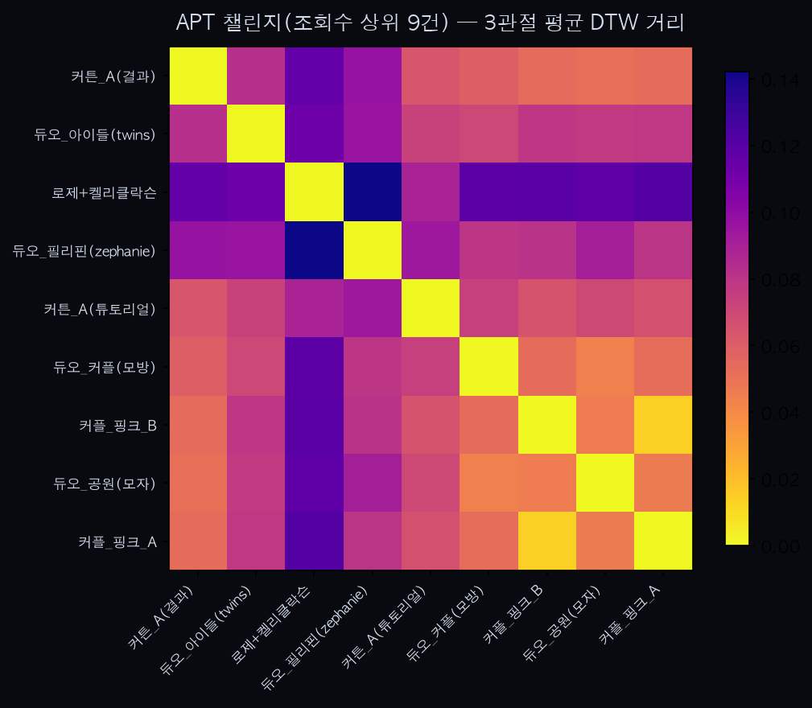

APT. 챌린지 — 조회수 상위 9건으로 재검증

0. 배경
`apt_dance_analysis.md`(11건, 조회수 고려 없이 검색 순서대로 수집)의 한계 중 하나가 "이 영상이 실제로 그 챌린지를 수행한 게 맞는지"에 대한 신뢰도였다. 이번엔 후보 22개의 조회수를 전부 조회해(`yt-dlp --print view_count`) 구조적으로 유효한(1~2인, 실시간 속도, 안무 일치) 클립 중 조회수 40만 이상만 추려 재실행했다. 코드는 `analyze_apt_dance_hiviews.py`, 영상은 `sample_dance_apt_hiviews/`.

1. 조회수 분포와 컷라인
후보 22개의 조회수를 전수 조사한 결과 40만 회 근처에서 뚜렷한 단층이 있었다 — 상위 9건은 42만~6,300만 회, 그다음은 7.5만 회로 5배 이상 떨어진다. 이 단층을 컷라인으로 썼다.

| 라벨 | 조회수 | 비고 |
|---|---|---|
| 커플_핑크_A | 63,012,222 | |
| 커튼_A(튜토리얼) | 13,332,148 | |
| 듀오_커플(모방) | 8,847,483 | |
| 듀오_공원(모자) | 4,758,801 | |
| 커플_핑크_B | 1,872,230 | 커플_핑크_A와 동일 배경·의상 — 같은 크리에이터의 다른 게시물로 추정 |
| 듀오_필리핀(zephanie) | 1,367,430 | |
| 듀오_아이들(twins) | 711,716 | |
| 커튼_A(결과) | 467,850 | |
| 로제+켈리클락슨 | 421,818 | 안무 창시자 로제 본인이 켈리 클락슨 쇼에서 직접 시연 |

기존 11건 중 조회수가 낮았던 solo_옥상(1,188회)·solo_현관(11,019회)·듀오_스튜디오(75,465회)·커튼_A(템포)(35,536회)는 이번 컷라인에서 자연히 탈락했다.

2. 결과
쌍별 DTW 거리(36쌍): 최소 18.2 / 평균 128.8 / 최대 259.4 — 조회수 무관 표본(11건, 최소 44.4/평균 88.4/최대 153.7)보다 분산이 훨씬 커졌다.

동일 크리에이터 추정 쌍 둘의 결과가 대비된다:
- **커플_핑크_A ↔ 커플_핑크_B: 18.2 — 전체 36쌍 중 압도적 1위.** 2위(59.7)와도 3배 이상 차이 나는 명확한 최근접 쌍이다. 이전 파일럿(11건)에서 가장 가까운 쌍이 44.4였던 것과 비교해도 훨씬 강한 근접 신호 — 조회수로 거른 덕에 "진짜 같은 사람"일 확률이 높아진 표본에서 더 뚜렷한 항상성 신호가 나온 것일 수 있다.
- **커튼_A(결과) ↔ 커튼_A(튜토리얼): 112.2 — 36쌍 중 20위(중간).** `apt_dance_analysis.md` 5번에서 짚은 "같은 사람이라도 튜토리얼(느린 설명 템포)과 실연(정상 속도)은 다이내믹스가 갈린다"는 가설이 이번에도 재현됐다.
- **로제+켈리클락슨은 다른 모든 클립과 가장 멀다** — 토크쇼 중 대화·시연이 섞인 상호작용이라 다른 클립들의 "집에서 완주하는 캐주얼 퍼포먼스"와 다이내믹스 성격 자체가 다르기 때문으로 보인다. 정확한 원안무가(로제) 데이터가 오히려 가장 이질적으로 나온 건 흥미로운 방법론적 발견이다.

3. 해석
조회수 필터는 두 가지 효과를 보였다: (1) 동일 크리에이터 쌍(커플_핑크)의 근접 신호가 이전보다 훨씬 뚜렷해졌고, (2) 전체 거리 분산이 커져 "구조는 같지만 맥락(토크쇼 vs 캐주얼, 튜토리얼 vs 실연)이 다른 퍼포먼스"가 더 잘 갈렸다. n=9는 여전히 작지만, 조회수를 신뢰도 신호로 쓰는 것이 최소한 "이 데이터가 실제로 그 챌린지를 수행했는가"에 대한 불확실성은 줄여준다는 정황을 보여준다.

4. 한계
- 조회수가 높다고 안무 수행 정확도가 보장되진 않는다 — 다만 무작위 표본보다 유명 크리에이터/공식 계정일 가능성이 높다는 간접 신호일 뿐이다.
- n=9, 36쌍 — 여전히 통계적 유의성 논할 규모는 아니다.
- 커플_핑크_A/B가 진짜 동일인인지는 시각적 정황(같은 거실·같은 의상)에 근거한 추정이지 계정 확인은 안 했다.
- 컷라인(40만)은 이번 후보군의 분포에서 나온 편의적 기준이지 일반화된 임계값은 아니다.

5. 다음 단계
"조회수 상위만 추려서 다시 본다"는 접근을 킥드럼·애플 챌린지에도 소급 적용해볼 수 있다. 또한 커플_핑크 A/B처럼 확실한 동일 크리에이터 반복 게시물을 의도적으로 더 찾아 모으면, 우연히 얻은 신호를 진짜 항상성 검증용 표본으로 키울 수 있다.

6. `dtw()` 경로 길이 정규화 반영 재실행 + 2번 해석 일부 정정 (2026-07-10)
`golden_dance_analysis.md`에서 밝혀진 길이-편향 문제를 고치며 `analyze.py::dtw()`를 `D[n,m] / (n+m)`로 정규화했다. 재실행 결과: 쌍별 거리(36쌍) 최소 0.0137 / 평균 0.0785 / 최대 0.1422(절대 스케일은 정규화 전과 비교 무의미).

두 "동일 크리에이터 추정" 쌍에 정규화가 미친 영향은 서로 달랐다:
- **커플_핑크_A ↔ 커플_핑크_B: 0.0137, 여전히 36쌍 중 압도적 1위** — 2위(0.0441)와의 격차 비율도 정규화 전(약 3.3배)과 거의 같다(약 3.2배). 두 클립의 트리밍 후 길이가 664·667프레임으로 애초에 거의 같았기 때문에, 이 신호는 길이 편향의 산물이 아니라 실제로 견고했다는 뜻이다.
- **커튼_A(결과) ↔ 커튼_A(튜토리얼): 0.0638 — 36쌍 중 20위 → 11위로 상승.** `apt_dance_analysis.md` 8번에서 확인한 것과 같은 패턴이다 — 튜토리얼(1155프레임)이 결과(617프레임)보다 길어서 정규화 전엔 실제보다 더 멀어 보였다. **2번의 "가설이 재현됐다"는 표현은 절반만 맞다** — 방향은 맞지만 격차 크기는 길이 편향으로 과장돼 있었다.

로제+켈리클락슨이 모든 클립과 가장 멀다는 결과는 정규화 후에도 그대로 유지됐다(토크쇼 맥락 자체가 다르다는 해석은 길이 문제와 무관하므로 영향받지 않음).
