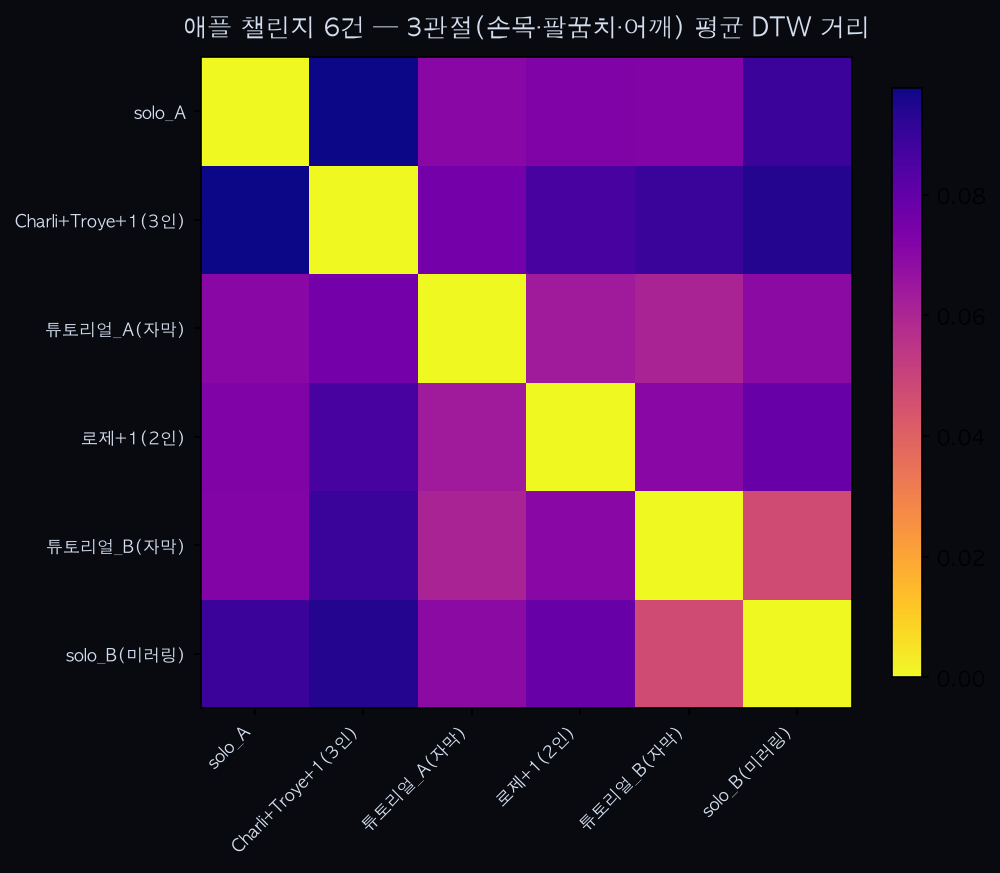

유튜브 '애플(Apple, Charli XCX)' 챌린지 6건 분석 — 다른 안무로 교차검증

0. 배경
`youtube_dance_analysis.md`가 검증한 "같은 안무·다른 사람 → DTW 거리로 구별 가능한가"가 킥드럼베이스 챌린지 하나에서만 나온 우연은 아닌지 확인하기 위해, 완전히 다른 챌린지(켈리 헤이어가 만든 애플 챌린지 — 팔 교차·체스트 팝·힙 탭·스플릿·운전 동작)로 같은 방법론을 반복했다. 코드는 `analyze_apple_dance.py`, 영상은 `sample_dance_apple/`(gitignore 처리, 저장소에는 없음).

1. 데이터
6건: 솔로 2건(solo_A, solo_B — 미러링 튜토리얼), 자막 오버레이 튜토리얼 2건(동작 이름이 화면에 뜨지만 안무 자체는 연속 수행), 2인 등장(로제+동행), 3인 등장(Charli XCX·Troye Sivan·1인). 킥드럼 데이터셋에도 다인원 클립이 섞여 있었고 문제없이 처리됐던 전례를 따라 그대로 포함했다.

후보 10개 중 계정 정지·비공개로 4개는 접근 불가, 6개 확보. 프레임 캡처로 실제 안무 수행 여부 확인 후 투입.

2. 방법
`youtube_dance_analysis.md`와 동일 — 오른손목·팔꿈치·어깨 3관절 속도, `trim_motion`으로 움직임 구간만 남긴 뒤 DTW 거리 평균. QC로 각 클립의 `trim_motion` argmax 위치와 유지 프레임 수를 확인해 콜드스타트 아티팩트(10번 섹션에서 발견한 문제) 여부를 점검 — 6건 모두 정상 범위(유지 프레임이 전체 길이의 90% 이상)로 이상 없음.

3. 결과
쌍별 DTW 거리(15쌍): 최소 37.7 / 평균 73.6 / 최대 95.1.

가장 가까운 쌍: 튜토리얼_B ↔ solo_B(미러링) — 37.7. 둘 다 자막/미러링 스타일의 "가르치기용" 퍼포먼스라는 공통점이 있다.
가장 먼 쌍: Charli+Troye+1(3인) ↔ 튜토리얼_A — 95.1. 다인원 캐주얼 촬영과 자막 오버레이 정형 튜토리얼의 대비.

4. 해석
킥드럼 챌린지(11인, 55쌍, 최소 29.1/평균 83.5/최대 178.6)와 비교하면, 거리의 상대적 스케일(최소~평균~최대 비율)이 비슷한 자릿수로 나온다 — 안무가 완전히 다른데도 "같은 사람만큼 가깝지도, 완전히 무관할 만큼 멀지도 않은" 중간 분산 패턴이 재현됐다. n=6이라 확정할 수는 없지만, 킥드럼 챌린지에서 관찰한 패턴이 그 챌린지 하나에 국한된 우연은 아니라는 약한 교차검증 신호로 볼 수 있다.

5. 한계
- n=6, 15쌍 — 통계적 유의성 없음. 패턴 확인 수준.
- 크리에이터별 반복 게시물 없음 — 항상성 검증 불가 (킥드럼 챌린지와 동일한 한계).
- 2~3인이 함께 등장하는 클립에서 MediaPipe가 정확히 어떤 인물을 추적했는지 개별 검증하지 않았다 — 프레임상 가장 크게·중앙에 나온 인물을 추적했을 가능성이 높지만 확인된 사실은 아니다.
- 애플 챌린지는 상반신 위주(킥드럼)보다 전신 동작(스플릿·힙 탭)이 많은데, 이번 분석은 3관절(손목·팔꿈치·어깨)만 써서 하반신 동작 정보는 반영하지 못했다.

6. 다음 단계
같은 방식으로 제3, 제4의 챌린지를 계속 늘려 "챌린지 종류와 무관하게 패턴이 재현되는가"를 누적 검증하는 것이 유튜브 데이터 활용의 다음 축이다. 항상성(동일 크리에이터 반복 게시물) 확보는 챌린지 종류와 무관하게 여전히 미해결 과제다.

7. `dtw()` 경로 길이 정규화 반영 재실행 (2026-07-10)
`golden_dance_analysis.md`에서 발견한 길이-편향 문제를 고치며 `analyze.py::dtw()`를 `D[n,m] / (n+m)`로 정규화했다. 재실행 결과: 쌍별 거리(15쌍) 최소 0.0471 / 평균 0.0758 / 최대 0.0977(절대 스케일은 정규화 전과 비교 무의미). 가장 가까운 쌍(튜토리얼_B↔solo_B)과 가장 먼 쌍(Charli+Troye+1↔튜토리얼_A 계열)의 순위는 거의 그대로 유지됐다 — 이 6건은 애초에 트리밍 후 길이가 350~878프레임으로 다른 챌린지들보다 편차가 작아(튜토리얼_A가 가장 길지만 2배 미만), 정규화로 인한 순위 변동이 킥드럼·APT만큼 크지 않았다.
