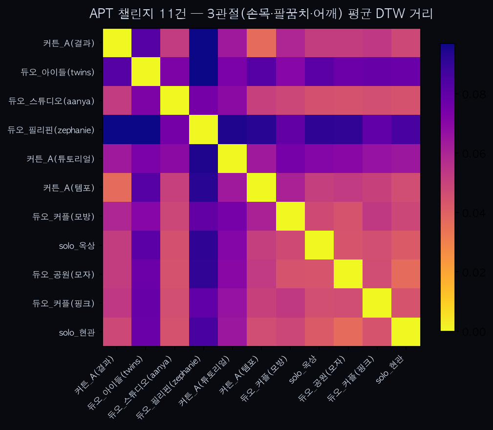

유튜브 'APT.(로제·브루노 마스)' 챌린지 11건 분석 — 세 번째 챌린지, 표본 확대 + 우연한 항상성 신호

0. 배경
`youtube_dance_analysis.md`(킥드럼)·`apple_dance_analysis.md`(애플)에 이은 세 번째 챌린지 교차검증. 이번엔 "갯수가 많은 챌린지"를 목표로 골랐다 — APT.는 유튜브가 공식 Shorts 챌린지 캠페인으로 밀어(Shorty Awards 수상, 인스타그램 역대 5번째 최다 참여 게시물) 커버 수 자체가 앞의 두 챌린지보다 훨씬 많다. 코드는 `analyze_apt_dance.py`, 영상은 `sample_dance_apt/`(gitignore 처리).

1. 데이터 선별 — 후보 20개 → 11개
검색으로 확보한 후보 20개를 프레임 캡처로 육안 확인 후 9개를 제외했다. 이번 파일럿에서 새로 정리된 제외 기준:
- 3인 이상 그룹(농구 유니폼 7인조 거리 공연, 6인 라인업, 3인 가족 집단): 단일 인물 추적 가정이 흔들려 제외.
- 분할 화면(한 프레임에 "VER1"/"VER2" 두 안무가 동시에 잡힘): DTW가 어느 쪽을 추적했는지 불명확해 제외.
- 수중 촬영: 굴절·기포 왜곡 + 댓글창에 "Can u do APT dance pls"가 떠 있어 실제 안무 수행 여부 자체가 불확실해 제외.
- 0.5배속 명시("x 0.5 Speed" 워터마크): 실제 재생 속도가 아니므로 다른 클립과 속도를 비교하는 게 무의미해 제외.
- 곡·안무 매칭이 불확실한 제네릭 영상(해시태그만 걸고 다른 챌린지처럼 보임): 챌린지 자체를 못 알아봐서 제외.

남은 11개는 솔로 2건, 듀오 7건(연인·트윈·필리핀 크리에이터 등), 그리고 우연히 발견한 "커튼_A" 3건(아래 3번 참고)이다. 킥드럼·애플 챌린지 파일럿에서도 듀오/트리오 클립을 포함해도 문제없었던 전례를 따라 2인 클립은 그대로 포함했다.

2. 방법
앞의 두 파일럿과 동일 — 오른손목·팔꿈치·어깨 3관절 속도, `trim_motion`, DTW 평균 거리. QC로 전 클립의 `trim_motion` 유지 프레임 비율을 확인해 콜드스타트 아티팩트(10번 섹션에서 발견한 문제) 여부 점검 — 11건 모두 유지 프레임이 전체 길이의 65% 이상으로 정상.

3. 우연한 발견 — "커튼_A" 3건, 동일 크리에이터로 추정
후보 중 `GuJpK6pLDUQ`("APT Dance Tutorial", run/clap/run/clap/turn 자막), `KidQow3_dpY`("Tempo" 버전), `01Wp7Bp6N14`("Results")가 배경(같은 빨간 커튼)·자막 스타일이 완전히 같아 동일 크리에이터의 연속 게시물로 추정된다. 킥드럼 챌린지 파일럿의 sura_A/sura_B(같은 핸들 추정, n=1쌍)보다 한 단계 나아가 이번엔 3개 클립(3쌍)을 우연히 확보했다 — 의도적으로 모은 게 아니라 검색 과정에서 발견한 것이라 표본 설계는 아니지만, 항상성 참고 신호로는 지금까지 중 가장 두꺼운 데이터다.

4. 결과
쌍별 DTW 거리(55쌍): 최소 44.4 / 평균 88.4 / 최대 153.7.

커튼_A 내부 3쌍:
- 커튼_A(결과) ↔ 커튼_A(템포): 44.4 — **전체 55쌍 중 1위**, 가장 가까운 쌍.
- 커튼_A(튜토리얼) ↔ 커튼_A(템포): 111.4 — 55쌍 중 43위.
- 커튼_A(결과) ↔ 커튼_A(튜토리얼): 112.2 — 55쌍 중 45위.

5. 해석
같은 사람(추정)끼리인데 결과가 갈렸다 — "템포"와 "결과"는 서로 전체 표본 중 가장 가까운 쌍인 반면, "튜토리얼"은 같은 사람의 다른 두 영상과도 오히려 먼 쪽(43·45위)에 속한다. 프레임 수를 보면 원인이 보인다: 튜토리얼은 트리밍 후 1155~1160프레임인데 템포·결과는 각각 612·617~621프레임으로 절반 수준이다 — 튜토리얼 영상은 "run, clap, run, clap, turn"을 한 박자씩 짚어가며 가르치는 속도라 실제 안무보다 느리고, 템포·결과는 정상 속도 퍼포먼스이기 때문으로 보인다.

이게 시사하는 바는 명확하다: **같은 사람이라도 촬영 목적(가르치기 vs 실연)에 따라 템포가 달라지면 다이내믹스 서명도 달라진다.** plan.md가 항상성 검증에 "동작 종류·속도 통제"를 전제로 깔았던 이유가 실측 데이터로 확인된 셈이다 — 항상성은 "같은 사람"만으로 성립하지 않고 "같은 사람 + 같은 템포/맥락"이 조건이라는 것.

6. 한계
- 커튼_A 3건이 진짜 동일 크리에이터인지는 배경·자막 스타일 유사성에 근거한 추정이지 확인된 사실이 아니다(계정 확인 안 함).
- n=11, 55쌍 — 여전히 통계적 유의성을 논할 규모는 아니다.
- 듀오 클립 7건에서 MediaPipe가 정확히 어느 인물을 추적했는지 개별 검증하지 않았다(애플 챌린지 파일럿과 동일한 한계).
- "튜토리얼 vs 실연" 템포 차이가 이번 결과를 얼마나 좌우했는지 정량적으로 분리하지 않았다 — 프레임 수 비교로 정황만 확인.

7. 다음 단계
표본 규모는 킥드럼(11)·애플(6)·APT(11)로 챌린지마다 편차가 크다 — 다음은 "커튼_A" 같은 동일 크리에이터 반복 게시물을 의도적으로 찾아 항상성을 정식 검증하는 것과, 이번에 발견한 "템포 차이가 같은 사람도 멀어지게 만든다"를 통제된 직접 촬영 데이터(같은 사람, 같은 속도로 반복 촬영)로 재확인하는 것이다.

8. `dtw()` 경로 길이 정규화 반영 재실행 + 5번 해석 정정 (2026-07-10)
`golden_dance_analysis.md`에서 밝혀진 대로, `dtw()`가 정규화 없이 시퀀스 길이에 비례해 커지는 값을 반환하고 있었다 — 튜토리얼(1155~1160프레임)이 템포·결과(612~621프레임)보다 딱 그만큼 더 멀어 보였을 가능성이 있다는 뜻이다. `analyze.py::dtw()`를 `D[n,m] / (n+m)`로 정규화한 뒤 재실행했다.

결과: 쌍별 거리(55쌍) 최소 0.0365 / 평균 0.0629 / 최대 0.0969(절대 스케일은 정규화 전과 비교 무의미). 커튼_A 내부 3쌍 순위가 바뀌었다:
- 커튼_A(결과) ↔ 커튼_A(템포): 0.0365 — 여전히 55쌍 중 1위.
- 커튼_A(튜토리얼) ↔ 커튼_A(템포): 0.0636 — **43위 → 29위**로 상승.
- 커튼_A(결과) ↔ 커튼_A(튜토리얼): 0.0638 — **45위 → 30위**로 상승.

**5번의 해석은 절반만 맞았던 것으로 정정한다.** "튜토리얼이 다른 두 영상과 유독 멀다"는 정도는 정규화 전 추정치보다 훨씬 약하다 — 하위 20% 밖(43·45위)이 아니라 중위권(29·30위/55)이었다. 즉 튜토리얼-실연 간 차이가 아예 없는 건 아니지만(여전히 1위 쌍보다는 멀다), 그 격차의 상당 부분은 순수한 템포 차이가 아니라 **길이 편향이 만든 착시**였다. "같은 사람 + 같은 템포/맥락이 항상성의 조건"이라는 결론 방향은 유지되지만, 이 데이터만으로 그 효과 크기를 주장하는 건 과장이었다.

## 9. 7번 "다음 단계" 실제 테스트 — 통제된 반복 촬영 데이터로 (2026-07-23)

7절에서 제안한 두 가지("동일 크리에이터 반복 게시물로 항상성 정식 검증" / "템포 차이 가설을 통제된 직접 촬영으로 재확인")를 실제로 있는 데이터로 테스트했다. `sample/compressed/`에 3명(A·B·C) × 3회 반복 촬영이 이미 있어(유튜브 스크레이핑이 아니라 직접 촬영, 즉 본문이 말한 "통제된 직접 촬영 데이터"에 해당) `analyze.py`로 바로 돌려봤다.

**방법**: `python analyze.py --people "A:...A_1.mp4,A_2.mp4,A_3.mp4" "B:..." "C:..."` (기존 도구 그대로, 새 코드 없음).

**결과**: Rank-1 Accuracy 33.3%, EER 42.6% — 3인 분류 기준 우연 수준에 가까운 약한 신호. 사람별 본인-내/타인-간 평균 DTW:

| 사람 | 본인 내(Within) | 타인 간(Between) | 방향 |
|---|---|---|---|
| A | 0.0018 | 0.0022 | Within < Between (맞는 방향) |
| B | 0.0016 | 0.0022 | Within < Between (맞는 방향) |
| C | 0.0027 | 0.0028 | 거의 동일 (항상성 신호 거의 없음) |

**템포 차이 가설은 이 데이터에서 오히려 반증된다.** trim_motion 정렬 후 프레임 수로 본 사람별 내부 템포 편차는 A(137/201/172, ~32% 편차) > B(174/175/141, ~19%) > C(173/200/155, ~13%) 순인데, 항상성이 가장 강해야 할 C(편차 최소)가 오히려 within≈between으로 가장 약했고, 편차가 가장 큰 A가 오히려 방향은 맞았다. "템포 편차가 클수록 같은 사람도 멀어진다"는 단순 가설대로라면 순서가 거꾸로여야 한다.

**해석**: 8절에서 튜토리얼-실연 격차의 상당 부분이 "길이 편향 착시"였다고 정정한 것과 같은 맥락 — 템포 자체보다 각 촬영에서 다른 요인(카메라 각도·프레임 안 신체 크기·손목 관절 검출 안정성 등)이 다이내믹스 서명에 더 크게 개입했을 가능성이 있다. n=3명·3회뿐이라 이 순서 자체가 우연일 수도 있어 단정은 이르다 — 그래도 "템포 차이가 항상성을 깨는 주범"이라는 7절의 가설을 이 통제된 데이터가 그대로 확인해주지 않는다는 것 자체가, 다음에 봐야 할 게 템포가 아니라 다른 촬영 조건일 수 있다는 새 단서다.

**한계**: n=3명(9샘플)으로 여전히 통계적 유의성을 논할 규모가 아니다. 어느 손목을 추적했는지, 두 세트(A_1-3 vs sample/compressed/A_1-3)가 같은 촬영 세션인지도 확인 안 됨.

