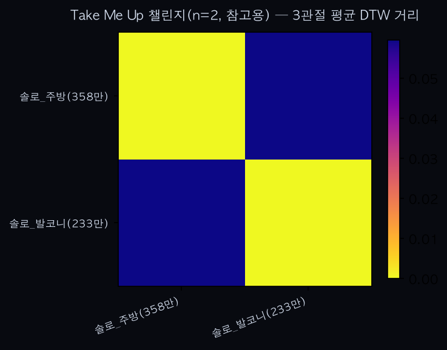
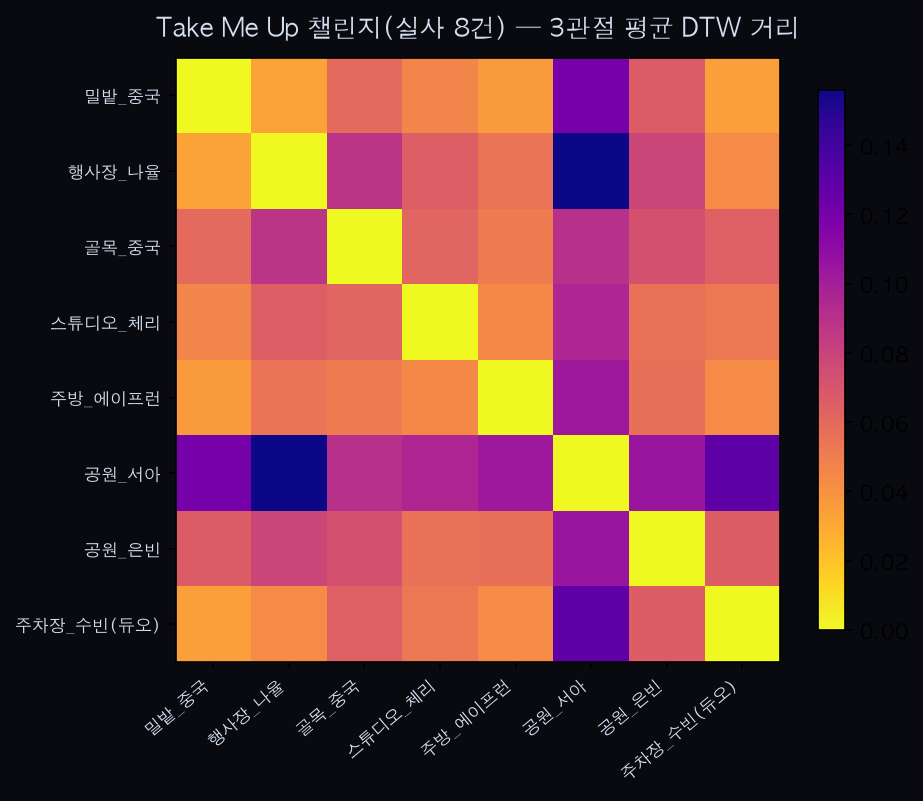
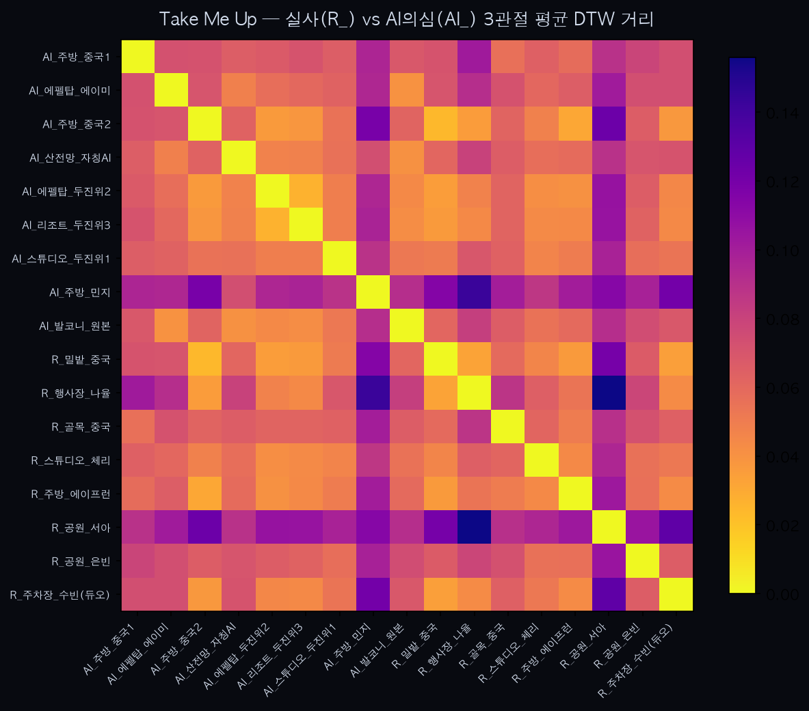
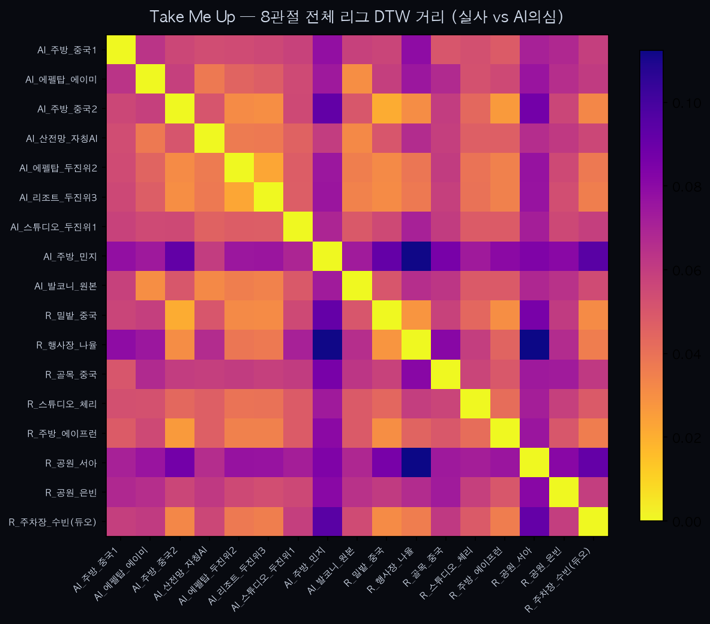

'Take Me Up'(Ralphi Rosario) 챌린지 — n=2 파일럿에서 실사 vs AI의심 클러스터 발견까지

0. 배경
사용자가 유튜브 쇼츠 링크(`tFePzSW3AVE`)를 보내며 이 챌린지로 분석을 요청했다. 검색 결과 1997년 곡 "Take Me Up (Gotta Get Up)"(Ralphi Rosario ft. Donna Blakely)이 2026년 리믹스로 재유행하며 생긴 셔플댄스/포인트 안무 챌린지로 확인됐다.

1. 데이터 선별 — 조회수 기준 없이까지 낮춰도 n=2
1차 검색(조회수 40만+ 기준)에서 실사·1~2인 클립이 2개뿐이라 사용자에게 확인한 뒤, 조회수 기준을 사실상 없애고 검색 방법도 확장했다 — WebSearch로 10개 이상의 쿼리 변형(한/영, 가사 기반, 리믹스명 기반)을 시도했고, 추가로 `yt-dlp "ytsearch40:..."`로 유튜브 자체 검색 API를 직접 조회했다(구글 일반 검색보다 유튜브 쇼츠 인덱싱이 나을 것으로 기대). 그 결과로 찾은 추가 후보(`mRNYFkJ2ink`, 11.4만 뷰, "JUJU choreography")는 프레임 확인 결과 10인 이상의 대형 댄스 스튜디오 클래스라 단일 인물 추적 조건에 맞지 않아 제외했다. 그 외 검색 결과는 전부 6분 넘는 셔플댄스 강습 영상, 다른 챌린지의 오검색(레고 조립 영상, "Hype Me Up" 등 다른 곡), 풀렝스 리믹스 음원 영상이었다.

**결론: 조건에 맞는 실사·1~2인 YouTube 쇼츠는 2개가 사실상 상한이다.** `golden_dance_analysis.md` 0번에서 확인한 포켓댄스와 같은 패턴 — 챌린지 자체는 실재하고 TikTok 쪽엔 바이럴이 있는 것으로 보이지만, YouTube 전용 표본은 얇다.

최종 2건 (조회수순): 솔로_주방(358만, "Kitchen Apron Dance Challenge") · 솔로_발코니(233만, 사용자 제공). 코드는 `analyze_takemeup_dance.py`, 영상은 `sample_dance_takemeup/`.

2. 방법 및 결과
QC(`trim_motion` 유지 프레임 비율) 확인 — 두 클립 모두 98~99%로 정상. `dtw()` 경로 길이 정규화 적용(2026-07-10 수정 반영).

솔로_주방 ↔ 솔로_발코니: **0.0594** (경로 길이 정규화 DTW). n=2·1쌍이라 분포·순위 비교는 애초에 불가능하고, 이 하나의 값이 다른 챌린지들의 "다른 사람" 쌍 거리 범위(킥드럼 0.026~0.098, 애플 0.047~0.098, APT 0.037~0.097)와 같은 자릿수인지만 확인하는 참고 수치다 — 확인 결과 같은 자릿수(0.03~0.10)에 들어온다.

3. 해석
n=2로는 "패턴"이라고 부를 수 있는 게 없다 — 이 문서는 결과 자체보다 **탐색 과정의 기록**으로서 가치가 있다. 조회수 필터를 아무리 낮춰도 후보가 안 나오는 경우, 원인은 (1) 이 챌린지가 애초에 YouTube보다 다른 플랫폼(TikTok)에 편중돼 있거나, (2) 검색 도구(WebSearch)의 인덱싱 한계일 수 있다 — 이번엔 `yt-dlp ytsearch`로 유튜브 자체 검색까지 시도했는데도 안 나왔으므로 (1)에 무게가 실린다.

4. 한계
- n=2 — 통계적으로 무의미. 파일럿이라기보다 "이 챌린지는 이 방법론에 안 맞는다"는 진단에 가깝다.
- 두 클립 다 솔로라 인물 추적 모호성 문제는 없지만, 표본이 너무 작아 이 챌린지의 고유성 패턴을 논할 수 없다.

5. 다음 단계
이 챌린지를 더 파고들려면 YouTube 밖(TikTok, Instagram Reels)까지 검색 범위를 넓히거나, 아예 다른(실사 커버가 풍부한) 챌린지로 넘어가는 게 낫다 — 지금까지 경험상 K-pop 계열 챌린지(킥드럼·APT·Golden)가 YouTube 실사 커버 수 기준으로 안정적으로 많았다.

6. 돌파구 — 유튜브 "동일 오디오" 리믹스 페이지 (2026-07-10)
텍스트 검색(WebSearch, `yt-dlp ytsearch`)이 이 챌린지에서 막힌 이유를 사용자에게 설명했다 — 이 클립들의 제목·해시태그가 곡명을 언급하지 않는 경우가 대부분이라, 텍스트 기반 검색 도구로는 애초에 찾을 수 없는 구조였다. 실제로 확보한 클립들의 제목은 "160만 조회수 민지의 댄스 챌린지"·"人靓身材正"(중국어, "예쁘고 몸매 좋다")·"두진위 뮤직 댄스 챈린지" 등으로 곡 정보가 전혀 없다. TikTok의 "사운드 페이지"(오디오 클릭 → 그 오디오를 쓴 모든 영상)에 해당하는 유튜브 기능이 `youtube.com/source/<영상ID>/shorts` 리믹스 페이지인데, 이 페이지는 그리드가 JS로 동적 렌더링돼 `WebFetch`(정적 HTML만 읽음)로는 내용을 못 읽는다는 것도 확인했다(1번 사용해봄 — 소스 영상 제목 한 줄만 나오고 그리드는 안 보임).

사용자가 직접 브라우저로 이 리믹스 페이지를 열어 링크 16개를 수집해 전달했다 — 텍스트 검색으로는 원천적으로 도달 불가능했던 데이터였다.

7. 프레임 검토 — 뜻밖의 패턴
16개를 다운로드해 프레임을 육안 확인하던 중, 후보의 상당수가 "이국적 배경(에펠탑·해변 리조트·산 전망 발코니·마천루 야경) + 비슷한 인상의 미인 얼굴 + 거의 동일한 팔 들어올리는 포즈"를 반복하는 뚜렷한 시각적 템플릿을 보였다. 일부는 제목에 아예 "AI가 추는 AI 댄스?"라고 자칭했고, "두진위" 태그(이전 킥드럼 챌린지 검색에서도 무관한 노이즈로 등장했던 태그)가 여러 클립에 반복 등장했다. 결정적으로, **사용자가 최초에 보낸 영상(`tFePzSW3AVE`)의 자체 캡션도 "ai인지 사람인지 헷깔림"**이었다 — n=2 파일럿(2번 섹션)에 이미 이 의심 클러스터가 절반 섞여 있었을 가능성이 있다는 뜻이다.

이 분류는 프레임 육안 검토(반복되는 배경 템플릿·자칭 AI 문구·두진위 태그 재등장)에만 근거한 "의심" 수준이며, 계정 신원이나 실제 생성 도구를 확인한 사실은 아니다.

- **AI의심(9건)**: `tFePzSW3AVE`(발코니, 원본), `nxYBzzqf_nQ`(주방), `71koL-3XxxE`(에펠탑), `1w4mBcLBTaY`·`Lewk8lXv38k`(중국풍 주방), `ekIMPnW3qbU`·`SeDYhQhYcJ0`·`ahx0RIAnt8U`(두진위 태그, 스튜디오/에펠탑/리조트), `Rp-S3JRYn8k`(산 전망, 자칭 "AI댄스")
- **실사(8건)**: `dj9IT2AC3iY`(원래 n=2 파일럿의 실사 클립, 주방), `gV3yefAb1Ao`(공원 산책 중 촬영, "댄싱서아" 5060세대 셔플댄스), `q-6X-Ektd9Q`·`CbbRIn1ibm4`(실제 거리 댄스 크루 "AFstarz" 소속 추정 — 실제 행사장 군중이 배경에 잡힘), `BUZAGZG2ZsQ`·`MHkk9onWMuo`(중국 시골/골목, 자연스러운 카메라 흔들림), `vmoZIJg-X20`(주차장, 성인+아이 듀오), `WyPYv01TFmg`(스튜디오, 자칭 "AI 언니 따라하기"지만 실제 기획사 콘텐츠로 추정)
- **제외(1건)**: `VgaJynuqR9k` — 실제 행사장이지만 10인 이상 군중이 잡혀 단일 인물 추적 불가.

8. 프로젝트 핵심 명제와의 연결 — 이 발견을 그냥 넘기지 않은 이유
이 프로젝트(BIO-IP)의 핵심 명제는 "AI는 사람 고유의 움직임 다이내믹스를 복제 못 한다"는 것이다. 우연히 발견한 이 실사/AI의심 혼재 데이터셋은 그 명제를 실측으로 찔러볼 드문 기회였다 — 그래서 사용자와 상의해 (1) 실사끼리의 "다른 사람" 비교, (2) 실사 vs AI의심의 별도 비교, 둘 다 진행하기로 했다. 코드는 `analyze_takemeup_real.py`(실사 8건)와 `analyze_takemeup_ai_vs_real.py`(전체 17건), 영상은 `sample_dance_takemeup_full/`.

9. 결과
**실사 8건끼리(28쌍)**: 최소 0.0325 / 평균 0.0703 / 최대 0.1560. 가장 가까운 쌍은 밀밭_중국↔행사장_나율(0.0325), 가장 먼 쌍은 행사장_나율↔공원_서아(0.1560) — 킥드럼(0.026~0.098)·애플(0.047~0.098)·APT(0.037~0.097)와 비슷한 자릿수·분산으로, 다른 챌린지들과 일관된 "다른 사람 → 넓게 퍼진 거리" 패턴을 재현했다.

**전체 17건(실사 8 + AI의심 9)**: 실사 내부 평균 0.0703, AI의심 내부 평균 0.0634, 교차 평균 0.0694 — 이 3분류만 보면 차이가 크지 않다.

**그런데 AI의심 9건 중 시각적 템플릿이 특히 뚜렷한 7건만 따로 떼어보면 이야기가 달라진다** (나머지 2건 `tFePzSW3AVE`·`nxYBzzqf_nQ`은 템플릿 특징이 상대적으로 약해 제외):
- 템플릿7 내부(21쌍): 최소 0.0265 / **평균 0.0561** / **최대 0.0721**
- 나머지10(실사8+비템플릿AI2) 내부(45쌍): 최소 0.0325 / **평균 0.0776** / **최대 0.1560**
- 템플릿7↔나머지10 교차(70쌍): 평균 0.0653

**템플릿7의 최대 거리(0.0721)가 나머지10 그룹의 평균(0.0776)보다도 낮다** — 즉 이 7개 클립은 서로 어떤 조합을 골라도 "나머지 그룹 평균 수준"보다 가깝다는 뜻이다. 나머지10 그룹은 최대가 0.1560으로 템플릿7의 최대보다 **2.2배** 넓게 퍼져 있다.

거리 행렬 히트맵에서도 육안으로 확인된다 — 좌상단 7×7 블록(템플릿7)이 균일하게 따뜻한 색조(가까움)를 보이는 반면, 나머지 영역은 색조 편차가 훨씬 크다. 특히 "공원_서아"·"행사장_나율" 행/열은 전체에서 가장 이질적인(짙은 보라~남색) 값들을 보인다.

10. 해석
**"같은 안무를 서로 다른 배경·얼굴로 수행한 것으로 의심되는 7개 클립이, 실제로 서로 다른 사람이 촬영한 클립들보다 훨씬 좁은 범위의 다이내믹스 거리를 보인다."** 이는 이 프로젝트의 핵심 명제("실제 사람의 움직임은 사람마다 고유하게 갈리고, 복제/생성된 움직임은 그 다양성이 없다")와 정확히 같은 방향의 신호다 — 만약 이 7건이 실제로 동일한 모션 소스(같은 안무 트래킹 데이터 또는 같은 생성 모델의 같은 시드)를 서로 다른 배경/아바타에 입힌 결과물이라면, 겉모습은 전부 달라도 관절 속도 곡선 자체는 원본 모션을 그대로 따르므로 서로 가까울 수밖에 없다. 반대로 실사 8건은 각자 다른 사람이 자기 나름의 리듬감·타이밍·과장 정도로 안무를 재해석했기 때문에 거리가 훨씬 넓게 퍼진다.

다만 이건 상관관계이지 증명이 아니다 — (1) 분류 자체가 프레임 육안 추정이라 계정 확인 등 독립 검증이 없고, (2) n=7·10으로 작아 우연일 가능성을 배제 못하며, (3) 실사 그룹 안에도 최대 0.1560까지 벌어지는 이질적인 쌍(공원_서아 관련)이 있어 "실사=항상 넓게 퍼짐"이 절대적이지도 않다. 그래도 우연히 발견한 이 데이터에서 프로젝트 핵심 명제와 같은 방향의 신호가 나온 건 주목할 만하다.

11. 한계
- AI 생성 여부는 시각적 패턴 추정이지 확인된 사실이 아니다. 계정 조사·역이미지 검색·생성 도구 특유의 아티팩트 분석 등 독립 검증은 하지 않았다.
- 템플릿7 vs 나머지10 분리 기준(어떤 클립이 "특히 뚜렷한 템플릿"인지)도 사후에 육안으로 정한 것이라 다소 자의적이다.
- 표본이 작다(n=7~10) — 이 결과 하나로 "AI 생성 콘텐츠는 항상 다이내믹스가 좁게 뭉친다"를 일반화할 수 없다.
- 실사 그룹 내 "공원_서아" 클립이 유독 이질적인 이유는 확인하지 않았다(개인차일 수도, 다른 원인일 수도).

12. "외형을 지우고 리그만 남기면?" — 8관절 전체로 재검증 (2026-07-10)
사용자 질문: 외형(얼굴·배경·의상)을 제거하고 움직임 리그만 보면 결과가 달라지는가. 답부터 말하면 — **이미 그렇게 하고 있었다.** MediaPipe 추출은 애초에 픽셀이 아니라 관절 좌표만 남기므로, 9~10번의 DTW 거리는 처음부터 "외형 제거된 리그" 위에서 계산된 것이다. 다만 지금까지는 `pose_extract.py`가 지원하는 8관절(양쪽 손목·팔꿈치·어깨·엉덩이, scope.md MVP 스펙과 동일) 중 오른팔 3개(손목·팔꿈치·어깨)만 써왔다 — 그래서 "관절을 더 많이 보면(리그를 더 완전하게 쓰면) 결과가 달라지는가"로 질문을 바꿔 검증했다. 코드는 `analyze_takemeup_fullrig.py`.

| | 3관절(오른팔만) | 8관절(양팔+양엉덩이) |
|---|---|---|
| 실사 8건 내부 | mean 0.0703 / max 0.1560 | mean 0.0595 / max 0.1124 |
| AI의심 9건 내부 | mean 0.0634 / max 0.1193 | mean 0.0520 / max 0.0918 |
| 템플릿7 내부 | mean 0.0561 / **max 0.0721** | mean 0.0470 / **max 0.0636** |
| 나머지10 내부 | mean 0.0776 / max 0.1560 | mean 0.0645 / max 0.1124 |

**결론 — 관절을 3개에서 8개로 늘려도 패턴은 그대로다.** 8관절에서도 템플릿7의 최댓값(0.0636)이 나머지10의 평균(0.0645)보다 낮다 — 3관절 때와 정확히 같은 구조("템플릿7은 어떤 조합을 골라도 나머지 그룹 평균 수준보다 가깝다")가 재현됐다. 절대 스케일은 전체적으로 작아졌는데(관절 수가 늘면서 평균화 효과), 이는 팔 하나만 볼 때보다 양팔+엉덩이를 같이 보면 개인차가 상대적으로 희석되기 때문으로 보인다 — 그럼에도 템플릿7 vs 나머지10의 **상대적 분리(격차)는 유지**됐다.

즉 이번 발견은 "우연히 오른팔 하나만 봐서 나온 착시"가 아니라, 사람이 실제로 쓰는 신체 부위(양팔+골반)를 더 폭넓게 봐도 유지되는 신호라는 교차검증이 됐다. (다만 다리·발목은 pose_extract.py가 아직 지원하지 않아 셔플댄스의 핵심인 풋워크는 이번에도 반영 못 했다 — 8번·10번 한계와 이어지는 지점.)

13. 다음 단계
이 우연한 발견을 정식 검증 항목으로 승격할 가치가 있다 — plan.md의 향후 계획(6개월, "외형 제거 후에도 식별되는가")과 직접 연결된다. 다음에 늘릴 것: ①의심 클러스터의 계정·출처를 역추적해 AI 생성 여부를 더 확실히 검증, ②다른 챌린지(킥드럼·APT·Golden)에서도 같은 리믹스 페이지 방식으로 AI의심 콘텐츠가 섞여 있는지 재조사(이미 확보한 데이터셋에 몰랐던 AI 클립이 섞여 있을 가능성), ③템플릿7처럼 유독 좁게 뭉치는 클러스터를 발견하면 그 자체를 "AI 생성 의심 탐지 신호"로 정식화하는 방법론 개발.
