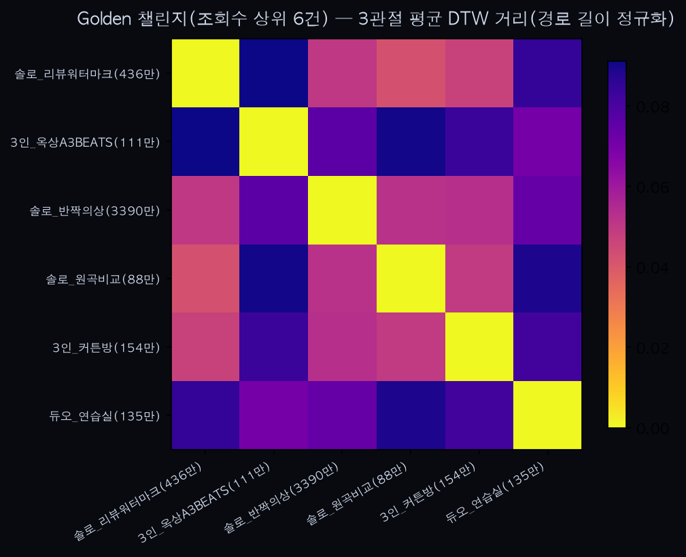

'Golden'(HUNTR/X, KPop Demon Hunters) 챌린지 — 조회수 상위 4건, 포켓댄스 대체 파일럿

0. 배경 — 포켓댄스는 왜 버렸나
`apt_dance_hiviews_analysis.md`의 방법론(조회수로 후보 필터링)을 다음 챌린지에도 적용해보려고 처음 고른 게 포켓댄스(PokéDance, 포켓몬 공식 챌린지)였다. 그런데 고조회수 후보를 확인해보니 대부분 실제 사람이 아니었다 — StEvEn(859만 뷰), Lotty Friends 2건(39만·25만 뷰)은 전부 2D 마스코트 애니메이션, 다른 후보는 Zepeto 3D 아바타나 VTuber 편집물이었다. 실사 커버는 조회수 100만대 이상 중엔 사실상 없었고(진짜 바이럴 실사 버전은 TikTok 쪽에 몰려 있는 것으로 보임), 남는 실사·1~2인 조건 클립은 186만·14.7만 뷰 단 2개뿐이었다. n=2로는 DTW 거리 행렬 자체가 의미가 없어, 사용자와 상의 후 실사 커버가 풍부한 다른 초대형 챌린지로 교체했다.

'Golden'을 고른 이유: 넷플릭스 애니메이션 '케이팝 데몬 헌터스' OST로, MV가 유튜브 10억 뷰를 넘긴 2025년 최대 히트곡 중 하나이며 실사 댄스 커버가 압도적으로 많다(APT.·킥드럼처럼 K-pop 계열 챌린지는 실사 커버 문화가 강하다는 게 이번에도 확인됨).

1. 데이터 선별
후보 9개 중 제외:
- 대형 댄스 학원 클래스(Team1 vs Team2, 8인 이상): 단일 인물 추적 가정이 흔들려 제외.
- "Singing Golden" 리액션 영상(얼굴 필터로 왜곡, 춤보다 노래 위주로 보임): 안무 수행 여부 불확실해 제외.

남은 후보 중 조회수 80만 이상 4건을 남겼다. 그중 zUv5uklv-RE(1,500만 뷰, 벽에 그림자 두 개가 지는 연출)는 QC에서 `trim_motion` 유지 프레임이 전체의 25%로 떨어져(콜드스타트/편집컷 아티팩트로 추정, `youtube_dance_analysis.md` 10번과 같은 패턴) 제외했다 — **조회수가 높아도 추출 품질이 깨지면 그대로 버린다**는 원칙을 재확인.

최종 4건 (조회수순): 솔로_반짝의상(3,393만) · 솔로_리뷰워터마크(436만) · 3인_커튼방(154만) · 솔로_원곡비교(88만). 코드는 `analyze_golden_dance.py`, 영상은 `sample_dance_golden/`.

2. 1차 결과 (n=4)
쌍별 DTW 거리(6쌍): 최소 79.0 / 평균 100.4 / 최대 117.7. 가장 가까운 쌍은 솔로_리뷰워터마크 ↔ 솔로_원곡비교(79.0), 가장 먼 쌍은 솔로_반짝의상(가장 바이럴한 단독 클립) ↔ 3인_커튼방(117.7).

3. 표본 확장 (n=4 -> 6, 2026-07-10)
후보를 더 찾아 "Mirrored" 댄스 연습 듀오(1건)와 3인조 크리에이터 A3 BEATS(HUNTR/X 세 멤버를 각자 맡아 옥상에서 촬영, 1건)를 추가했다. 둘 다 QC(유지 프레임 비율 90%대)는 통과했다.

쌍별 DTW 거리(15쌍): 최소 79.0 / 평균 206.9 / **최대 315.3**. 최소값은 그대로지만 평균이 2배, 최대가 2.7배로 급등했다 — 원인은 새로 추가한 2건의 **길이**다. 나머지 4건은 트리밍 후 891~1268프레임인데, 새로 추가한 2건은 2146·2361프레임으로 거의 2배다. `trim_motion`은 시작~끝 구간을 통째로 남기는 방식이라, 안무를 여러 번 반복하거나(연습 영상) 촬영이 긴 클립은 길이 자체가 DTW 거리를 지배해버린다 — 이 2건은 서로 간 거리(315.3, 전체 최대)조차 가장 멀어서, "길다"는 사실 하나가 "누구와도 안 닮았다"는 결과를 만든 것으로 보인다.

4. 해석
n=4일 때 보였던 79~118 범위의 "패턴"은 **길이가 비슷한 클립끼리 비교했을 때만** 의미가 있었다는 게 이번 확장으로 드러났다. `apt_dance_analysis.md`에서 이미 발견한 "튜토리얼(느린 템포) vs 실연(정상 속도)" 문제와 근본 원인이 같다 — 다만 이번엔 템포가 아니라 **반복 횟수/촬영 길이**가 원인이라는 변종이다.

5. 근본 원인 수정 — `dtw()` 경로 길이 정규화 (2026-07-10)
문제의 근원은 `analyze.py`의 `dtw()`가 두 시계열 간 DP 누적 비용을 그대로 반환한다는 데 있었다 — 이 값은 정의상 정렬 경로 길이(대략 n+m)에 비례해서 커진다. 즉 "같은 동작을 두 배 길게 찍은 영상"은 실제 동작이 똑같아도 거리값이 커질 수밖에 없는 구조였다. `dtw()`를 `D[n, m] / (n + m)`로 정규화하도록 고쳤다(`analyze.py:27`). `dynamic_id.py`가 같은 함수를 공유하므로 `test_dynamic_id.py`로 회귀 검증했고, identify()의 A/B 식별 결과는 그대로 유지됐다(다만 이 테스트엔 원래도 존재하던 `verify()`의 임계값 reject 이슈가 있는데, 수정 전후 동일하게 재현돼 이번 변경과 무관함을 git stash로 확인).

수정 후 재실행 결과 — 쌍별 거리(15쌍): 최소 0.0423 / 평균 0.0690 / 최대 0.0912. 정규화 전(최소 79.0/최대 315.3, 비율 4.0배)과 비교하면 최대/최소 비율이 2.2배로 줄어 극단적 왜곡은 해소됐다. 다만 완전히 사라지진 않았다 — 새로 추가한 긴 클립 2건(듀오_연습실·3인_옥상A3BEATS)은 여전히 서로 및 다른 클립과의 거리가 원래 4건 내부 거리(0.042~0.053)보다 다소 높은 쪽(0.070~0.091)에 몰려 있다. `n+m` 정규화는 근사치(실제 정렬 경로 길이가 아니라 상한값)라, 두 시계열의 길이 비율이 크게 벌어지면(이번 경우 약 2~2.6배) 잔여 편향이 남는다.

**이 수정은 `analyze.py::dtw()`를 쓰는 모든 스크립트(analyze_youtube_dance.py·analyze_apple_dance.py·analyze_apt_dance.py·analyze_apt_dance_hiviews.py·dynamic_id.py)에 공통 적용된다.** 이전 문서들(`youtube_dance_analysis.md`·`apple_dance_analysis.md`·`apt_dance_analysis.md`·`apt_dance_hiviews_analysis.md`)에 적힌 절대 거리값은 전부 정규화 이전 스케일이라, 그 스크립트들을 지금 다시 돌리면 훨씬 작은 값이 나온다 — 순위·해석(어느 쌍이 가깝고 먼지)은 대부분 유지될 것으로 보이지만(그 데이터셋들은 길이 편차가 이번만큼 크지 않았음), 재검증하진 않았다.

6. 한계
- n=6, 15쌍 — 여전히 작은 표본.
- 3인 클립(3인_커튼방·3인_옥상A3BEATS)에서 MediaPipe가 정확히 어느 인물을 추적했는지 개별 검증 안 함.
- `n+m` 정규화는 근사치라 길이 비율이 큰 클립 쌍엔 잔여 편향이 남는다(5번 참고) — 완전한 해결은 실제 워핑 경로 길이로 나누거나, 안무 한 사이클만 잘라 길이 자체를 맞추는 전처리가 필요.
- 포켓댄스 시도에서 배운 것도 여전히 유효: "조회수 필터"는 챌린지의 콘텐츠 생태계(실사 vs 애니메이션/아바타)에 따라 아예 작동하지 않을 수 있다.

7. 다음 단계
- (완료) `dtw()` 경로 길이 정규화.
- 잔여 편향을 마저 줄이려면: 실제 워핑 경로 길이로 정규화(백트래킹 필요)하거나, `trim_motion` 후 안무 한 사이클만 잘라 비교하는 전처리를 추가.
- 이전 4개 문서(킥드럼·애플·APT·APT 조회수판)를 정규화된 `dtw()`로 재실행해 절대값을 갱신할지는 사용자 판단에 맡긴다 — 순위 해석 자체는 아마 크게 안 바뀔 것으로 예상되지만 확인된 사실은 아니다.
