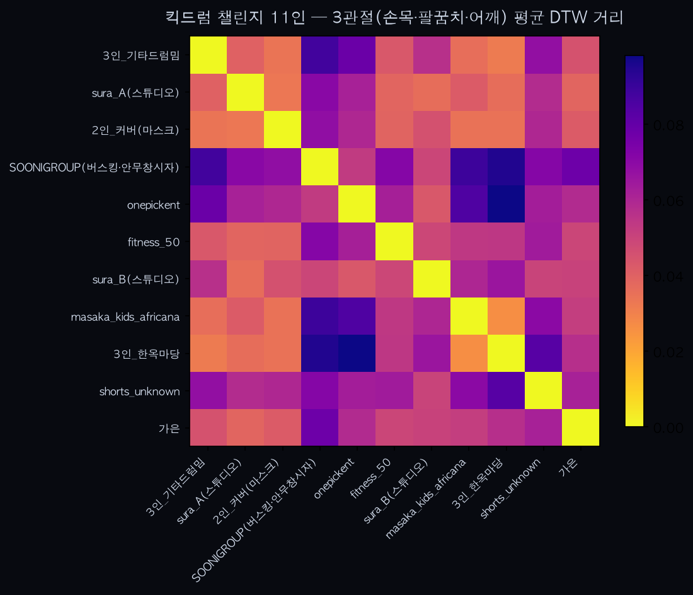

유튜브 킥드럼 챌린지 6인 분석 — 첫 실측 파일럿

0. 배경
plan.md에서 정한 "유튜브 안무 영상 = 고유성(1a) 대규모 검증 + 안무 통제 자연실험"이라는 역할을, `sample_dance/` 폴더의 실제 유튜브 쇼츠 6개로 처음 실행해봤다. 전부 같은 챌린지 안무("킥드럼(베이스) 챌린지" — 주먹을 들어올리는 동작 포함)를 서로 다른 크리에이터가 각자 촬영해 올린 영상으로, groupdance.md가 말한 "콘텐츠가 완전히 통제된 자연 실험" 조건을 실제 인터넷 데이터로 채운 첫 사례다.

1. 데이터
| 라벨 | 파일 | 해상도 | fps | 맥락 |
|---|---|---|---|---|
| sura_A(스튜디오) | @_kpop_sura_djsura_dance_challenge...mp4 | 1080×1920 | 30 | 스튜디오, 회색 배경 |
| SOONIGROUP(버스킹·안무창시자) | _-(1920p60).mp4 | 1080×1920 | 60 | 거리 버스킹, "안무 창시자" 자막 |
| onepickent | dancechallenge_onepickent...mp4 | 720×1280 | 60 | 스튜디오, 보라 배경 |
| fitness_50 | fitness_fitnessmotivation_50...mp4 | 1080×1920 | 30 | 헬스장, "50대여 운동하라" 피트니스 콘텐츠 |
| sura_B(스튜디오) | kickdrum_challenge_dance_sura_queenbee_yunamong...mp4 | 1080×1920 | 60 | 스튜디오, 베이지 배경 |
| shorts_unknown | shorts-(3840p30).webm | 2160×3840 | 30 | 스튜디오, 주황 배경 |

라벨은 영상 자체에 노출된 크리에이터 핸들/파일명을 그대로 썼다. 실명 확인은 하지 않았다 — personal.md가 권한 "익명 비교 설계" 원칙에 따라, 여기서는 "이 영상이 누구인지"가 아니라 "영상들끼리 서로 얼마나 다른가"만 본다.

sura_A와 sura_B는 파일명에 둘 다 "sura"가 들어 있어 동일 크리에이터의 서로 다른 게시물일 가능성이 있다 — 반복 촬영이 아니라 우연히 같은 핸들이 두 번 걸린 것이므로, 이 데이터로 "항상성"을 검증하는 게 아니라 참고용 신호로만 다룬다.

각 크리에이터당 영상이 1개뿐이라 반복(같은 사람 재현) 데이터가 없다 — 그래서 이번 파일럿은 고유성(조건 A, 서로 다른 사람 간 거리)만 보고, 항상성(조건 B)은 검증 대상에서 제외했다.

2. 방법
`pose_extract.py`(MediaPipe PoseLandmarker)로 오른손목 관절 좌표를 추출하고, 평활화 후 미분해 속도 곡선을 얻은 뒤, `analyze.py`의 DTW로 6개 영상 쌍(15쌍) 사이 거리 행렬을 만들었다. 코드는 `analyze_youtube_dance.py`.

3. 방법론적 발견 — 해상도 정규화가 빠져 있었다
1차 실행 결과, `shorts_unknown`(2160×3840, 다른 영상의 약 2배 해상도)이 나머지 5명 전원과 압도적으로 먼 거리로 나왔다. 원인은 동작 차이가 아니라 `pose_extract.py`가 관절 좌표를 픽셀 단위로 그대로 써서, 해상도가 클수록 같은 동작도 픽셀 이동량이 커지는 구조적 편향이었다. 이건 plan.md가 "유튜브 데이터는 촬영 조건이 통제 안 된다"고 미리 지적한 리스크가 실제로 발현된 사례다.

`pose_extract.py`에서 관절 좌표를 프레임 대각선 길이로 나눠 정규화하도록 고쳤다(해상도 무관 상대 속도로 변환). 수정 후 재실행하니 `shorts_unknown`의 이상치 패턴이 사라졌고, 로컬 샘플(`test_dynamic_id.py`)로 회귀 검증도 통과했다.

4. 결과
쌍별 DTW 거리 (정규화 후, 15쌍): 최소 88.3 / 평균 156.5 / 최대 202.7

가장 가까운 쌍 (구별이 가장 어려움):
1. sura_A ↔ fitness_50 — 88.3
2. sura_A ↔ sura_B — 113.9
3. sura_A ↔ shorts_unknown — 120.3

가장 먼 쌍 (가장 뚜렷하게 다름) — 전부 SOONIGROUP이 포함:
1. SOONIGROUP ↔ sura_B — 188.3
2. SOONIGROUP ↔ shorts_unknown — 189.4
3. SOONIGROUP ↔ onepickent — 202.7

5. 해석
같은 안무인데도 6명의 거리가 88~203으로 넓게 퍼져 있고, 특히 SOONIGROUP(거리 버스킹, "안무 창시자")이 스튜디오에서 찍은 나머지 5명과 항상 가장 멀다 — 촬영 환경(야외·이동 카메라·군중)과 퍼포먼스 맥락(창시자로서의 원곡 느낌) 차이가 동작 다이내믹스에 실제로 드러난다는 뜻일 수 있다. sura_A와 sura_B는 15쌍 중 2번째로 가까워, 동일 크리에이터일 가능성과 약하게 정합하지만 n=1쌍짜리 신호라 결론을 내릴 근거는 못 된다.

6. 한계
- 크리에이터당 영상 1개뿐 — 항상성(같은 사람 반복 시 일관성)은 이 데이터로 검증 불가.
- n=6명 — 통계적 유의성을 논할 규모가 아니다. "패턴이 있어 보인다" 이상의 주장은 못 한다.
- 단일 관절(오른손목) + 단일 특징(속도)만 사용 — plan.md 3번에서 이미 지적한 다관절 확장이 여기도 그대로 적용된다.
- 해상도는 정규화했지만 촬영 거리(줌)·프레임 컷 편집까지는 보정하지 못했다 — plan.md가 "유튜브 데이터는 저크 등 고차 미분 특징을 배제한다"고 정한 이유가 여기서도 유효하다.
- sura_A/sura_B 동일인 여부는 확인된 사실이 아니라 파일명에서 나온 가설이다.

7. 재검증 — trim_motion threshold 버그 수정 후 (2026-07-07)
로컬 표본(A/B/C)에서 `trim_motion`의 절대 threshold(0.08)가 MediaPipe 정규화 속도 스케일과 안 맞아 프레임이 과도하게 잘리는 버그를 발견·수정했다(threshold를 최고 속도 대비 비율로 변경). 이 데이터셋도 같은 함수를 쓰므로 재실행 — 거리 분포(최소 74.9/평균 154.0/최대 206.0, 이전 88.3/156.5/202.7)와 순위 패턴(SOONIGROUP 항상 최원거리, sura_A-B 3번째로 근접)이 거의 그대로 유지됐다. 유튜브 영상들은 로컬 클립보다 길어서(500~1200프레임) 이 버그의 영향이 작았던 것으로 보인다 — 이번 파일럿의 결론은 threshold 버그와 무관하게 유효하다.

8. 다관절 확장 (2026-07-07) — 오른손목 단일 관절 → 손목·팔꿈치·어깨 평균
`analyze_youtube_dance.py`가 `pose_extract.py`에서 이미 지원하던 다관절(`LANDMARK_INDEX`)을 그제서야 실제로 썼다. 관절별로 각각 `trim_motion` 후 DTW 거리를 구하고, `dynamic_id.py`의 `_distance_to_id`와 동일하게 관절 평균을 최종 거리로 쓴다(새 데이터 불필요, 코드만 확장).

재실행 결과: 거리 스케일은 줄었지만(최소 44.5/평균 95.1/최대 117.1 — 3관절 평균이라 절대값 자체는 단일 관절과 비교 의미 없음) **순위 패턴은 그대로**다. SOONIGROUP이 여전히 전원과 가장 멀고, sura_A·sura_B가 15쌍 중 2번째로 가깝다(단일 관절 때는 2~3번째, 오차 범위 안). 즉 오른손목만 봐도, 3관절을 같이 봐도 결론이 안 바뀐다 — 단일 관절 결과가 우연이 아니었다는 교차검증이 된 셈이다.

9. 다음 단계
plan.md Phase 4(9월, 유튜브 데이터 스케일업)의 축소판이 이번 파일럿이다. 다음에 늘릴 것: ①동일 크리에이터의 반복 게시물을 의도적으로 모아 항상성 신호 확보, ②같은 챌린지의 크리에이터 수를 6명 → 30명 이상으로 확장. 다관절 확장은 완료했다. 해상도 정규화 버그를 잡은 건 이번 파일럿의 실질적 성과이며, 앞으로 원본 소스가 뭐든(유튜브·직접 촬영 혼합) 이 정규화가 기본으로 들어가야 한다.

10. 6인 → 11인 확장 (2026-07-10)
9번의 ②(고유성 표본 확대)를 실행했다. 웹 검색으로 같은 챌린지("Kick Drum Bass"/DJ SURA - Queen Bee) 영상 10개 후보를 찾아 yt-dlp로 확보 시도 → 4개는 계정 정지·비공개로 접근 불가, 6개 다운로드 성공. 프레임 캡처로 실제로 같은 안무를 추는지 육안 확인 후 분석에 투입.

6개 중 1개("글래머_충전소" — EV 충전소 배경 b-roll)는 제외했다: `trim_motion`이 전체 785프레임 중 3프레임만 남기는 이상 현상 발견. 원인은 MediaPipe가 영상 첫 프레임에서 튀는 속도값(12.7, 실제 춤 동작 피크의 약 8배)을 뱉는 콜드스타트 아티팩트 — `trim_motion`이 시계열 최대값 대비 상대 threshold를 쓰기 때문에, 이 첫 프레임 스파이크가 전체 max를 오염시켜 나머지 진짜 춤 구간이 threshold 밑으로 밀려났다. 다른 11개 영상은 argmax가 중간 어딘가(전체 길이의 30~85% 지점)에 있어 이 문제가 없음을 확인 — 이번 1건은 개별 영상의 예외적 트래킹 실패지 파이프라인 전체의 구조적 버그는 아니라고 판단해, `trim_motion`은 건드리지 않고 이 클립만 표본에서 뺐다.

최종 11인(기존 6 + 신규 5) 재실행 결과: 쌍별 DTW 거리(55쌍) 최소 29.1 / 평균 83.5 / 최대 178.6. sura_A-sura_B는 55쌍 중 23번째로 가까움(6인 때는 15쌍 중 2~3번째) — 표본이 늘면서 상대 순위가 밀렸다. n=6에서 관찰된 "패턴"이 n=11에서도 그대로 유지되는지는 이번 결과만으로 결론 내리기엔 이르다 — SOONIGROUP·onepickent가 여전히 원거리 쪽에 몰려있지만, 신규 5인 중에서는 아직 반복 관찰(사람마다 최소 2개 영상)이 없어 "쌍이 가깝다/멀다"의 재현성 자체를 검증 못한다. 30명 목표(plan.md Phase 4)에는 아직 못 미친다 — 계속 늘려갈 것.

한계 추가: 이번 배치의 영상 상당수가 "동일 인물의 반복 게시물"이 아니라 매번 새 크리에이터라, 8번 항목(다관절 교차검증)과 같은 방식의 반복성 검증은 여전히 안 됨. 항상성(①) 확보는 다음 파일럿 과제로 남는다.

11. `dtw()` 경로 길이 정규화 반영 재실행 (2026-07-10)
`golden_dance_analysis.md`에서 발견한 문제(DTW 거리가 정규화 없이는 시퀀스 길이에 비례해 커짐)를 고치면서 `analyze.py::dtw()`를 `D[n,m] / (n+m)`로 정규화하도록 수정했다. 이 파일이 쓰는 `analyze_youtube_dance.py`도 같은 함수를 쓰므로 재실행.

결과: 쌍별 DTW 거리(55쌍) 최소 0.0261 / 평균 0.0561 / 최대 0.0981(절대 스케일은 정규화 전과 비교 무의미 — 자릿수 자체가 다름). 가장 가까운 3쌍(masaka_kids_africana↔3인_한옥마당, 3인_기타드럼밈↔3인_한옥마당 순)과 SOONIGROUP이 항상 가장 먼 패턴은 그대로 유지됐다. 다만 **sura_A↔sura_B가 55쌍 중 23번째(정규화 전) → 9번째(정규화 후)로 눈에 띄게 가까워졌다** — 이 두 영상의 길이 차이가 정규화 전엔 실제보다 더 멀어 보이게 만들었던 것으로 보인다. 동일 크리에이터 추정 신호가 정규화 후 더 뚜렷해졌다는 점에서, apt_dance_hiviews_analysis.md의 "커플_핑크" 사례와 같은 방향의 교훈이다.
